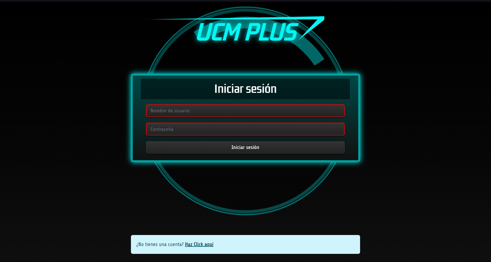
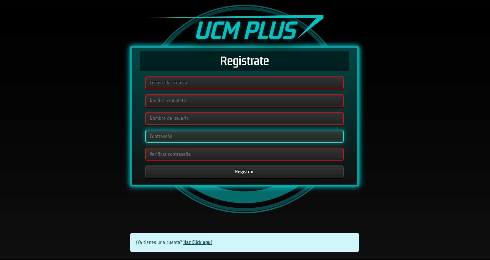
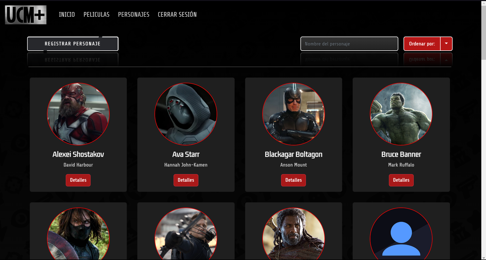
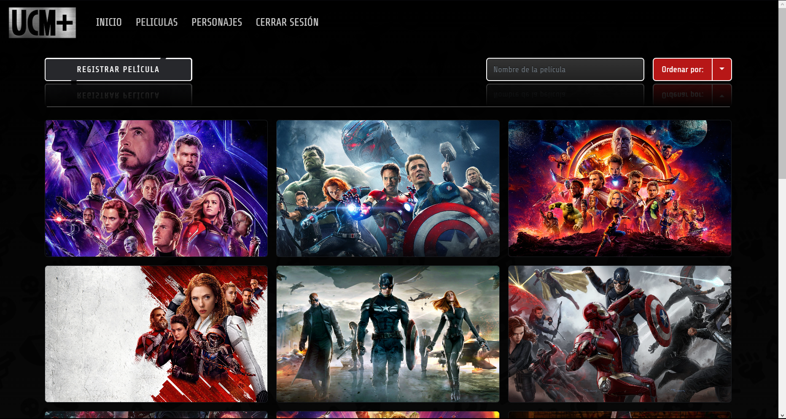

<!-- ABOUT THE PROJECT -->
# UCM Plus

Esta aplicación web te permite explorar y gestionar información sobre los personajes y películas del universo cinematográfico de Marvel.

La aplicación te permite gestionar dos modelos principales:

* Personajes del Universo Cinematográfico de Marvel: Puedes realizar operaciones CRUD en los personajes.
* Películas del Universo Cinematográfico de Marvel: Puedes realizar operaciones CRUD en películas.

Además, la aplicación cuenta con un sistema de autenticación que permite a los usuarios registrarse e iniciar sesión. Los datos de autenticación se almacenan en la base de datos MySQL.



### Características

* Personajes:
    * Listar todos los personajes.
    * Mostrar un personaje en detalle.
    * Registrar un nuevo personaje.
    * Editar un personaje existente.
    * Eliminar un personaje.
* Películas:
    * Listar todas las películas.
    * Mostrar una película en detalle.
    * Registrar una nueva película.
    * Editar una película existente.
    * Eliminar una película.
* Gestionar las relaciones entre personajes y películas. Puedes asignar un personaje a una o más películas, y viceversa.
* Autenticación:
    * Registro de usuario.
    * Inicio de sesión.
    * Cerrar sesión.

### Tecnologías

Este proyecto combina una interfaz React con un backend Express y una base de datos MySQL para crear una aplicación web completa.

* [![React][React.js]][React-url]
* [![Typescript][Typescript.io]][Typescript-url]
* [![Sass][Sass.io]][Sass-url]
* [![Bootstrap][Bootstrap.com]][Bootstrap-url]
* [![Express.js][Express.js]][Express-url]
* [![Mysql][Mysql.io]][Mysql-url]

<!-- GETTING STARTED -->
## Getting Started

### Requisitos previos

* Node.js
* npm
* MySQL
* Code editor (VS Code, Sublime Text, etc.)

### Configuración

1. Clonar el repositorio
   ```sh
   git clone https://github.com/Rayzler/UCM-Plus.git
   ```
2. Instalar paquetes del Frontend
   ```sh
   cd Frontend
   npm install
   ```
3. Instalar paquetes del Backend
   ```sh
   cd Backend
   npm install
   ```
4. Crear tu base de datos
   ```mysql
   CREATE DATABASE IF NOT EXISTS ucm_plus;
   ```
5. Establecer el nombre de usuario y la contraseña de Mysql en `Backend/src/database/DatabaseConnection.ts`
    ```ts
    private constructor() {
        this.dataSource = new DataSource({
            type: 'mysql',
            host: 'localhost',
            port: 3306,
            username: 'YOUR_MYSQL_USER',
            password: 'YOUR_MYSQL_PASSWORD',
            database: 'ucm_plus',
            synchronize: true,
            entities: [User, Movie, Character],
            ssl: {
                rejectUnauthorized: false
            }
        });
    }
   ```
6. Ejecutar el backend
    ```sh
   cd Backend
   npm start
    ```
7. Ejecutar el frontend
    ```sh
   cd Frontend
   npm start
    ```

<!-- USAGE EXAMPLES -->
## Usos

1. Acceda a la aplicación en la URL http://localhost:3000.
2. Si no está registrado, haga clic en el botón "Registrarse" para crear una cuenta.
   
3. Inicie sesión con su nombre de usuario y contraseña.
4. Una vez autenticado, podrá acceder a las siguientes funciones:
    * ### Personajes:
     
     * Accede a la lista de personajes haciendo clic en el enlace "Personajes".
     * Haz click en un personaje para ver su información en detalle.
     * Haz click en el botón "Registrar personaje" para crear un nuevo personaje.
     * Haz click en el botón "Editar" para editar un personaje existente.
     * Haz click en el botón "Eliminar" para eliminar un personaje.
   * ### Películas:
     
     * Accede al listado de películas haciendo clic en el enlace "Películas".
     * Haz clic en una película para ver su información en detalle.
     * Haga clic en el botón "Nueva película" para crear una nueva película.
     * Haga clic en el botón "Editar" para editar una película existente.
     * Haga clic en el botón "Eliminar" para eliminar una película.

<!-- MARKDOWN LINKS & IMAGES -->
[React.js]: https://img.shields.io/badge/React-20232A?style=for-the-badge&logo=react&logoColor=61DAFB
[React-url]: https://reactjs.org/
[Express.js]: https://img.shields.io/badge/express.js-222222?style=for-the-badge&logo=express&logoColor=green
[Express-url]: https://expressjs.com
[Bootstrap.com]: https://img.shields.io/badge/Bootstrap-563D7C?style=for-the-badge&logo=bootstrap&logoColor=white
[Bootstrap-url]: https://getbootstrap.com
[Mysql.io]: https://img.shields.io/badge/MySQL-2596be?style=for-the-badge&logo=mysql&logoColor=white
[Mysql-url]: https://www.mysql.com
[Typescript.io]: https://img.shields.io/badge/Typescript-2596be?style=for-the-badge&logo=typescript&logoColor=white
[Typescript-url]: https://www.typescriptlang.org
[Sass.io]: https://img.shields.io/badge/sass-FFFFFF?style=for-the-badge&logo=sass&logoColor=cc649b
[Sass-url]: https://sass-lang.com
